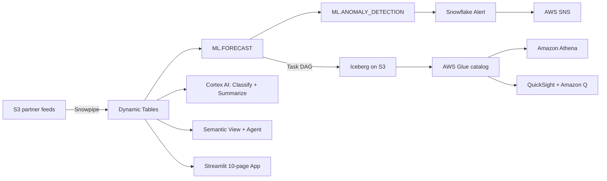

# Demand Optimization & Planning

Intelligent demand forecasting and inventory optimization powered by Snowflake Cortex AI + AWS — detect forecast degradation before it becomes overstock.

## Architecture

**7 Snowflake features + 6 AWS services** — Snowflake does everything natively; AWS proves the openness.

### Snowflake (hero)
| Feature | Usage |
|---------|-------|
| Dynamic Tables | FORECAST_ACCURACY, INVENTORY_HEALTH, DEMAND_SIGNALS |
| ML.FORECAST | 14-day demand forecast across 50 series |
| ML.ANOMALY_DETECTION | Demand spike/crash detection by category |
| Cortex AI (Claude Sonnet + SUMMARIZE) | Planning doc risk classification |
| Cortex Search + Semantic View + Agent | Natural language analytics |
| Snowflake Alert | Fires on forecast degradation → SNS |
| Snowflake Tasks | DAG: retrain → rescan anomalies → refresh Iceberg |

### AWS (supporting)
| Service | Usage |
|---------|-------|
| Amazon S3 | Raw data + Iceberg files |
| SQS + Snowpipe | Real-time partner demand ingest |
| Apache Iceberg + AWS Glue | Open table format export |
| Amazon Athena | Query Iceberg forecast |
| Amazon SNS | Alert notification target |
| Amazon QuickSight + Q | Executive dashboard |



## Personas

| Persona | Role | Key Questions |
|---------|------|---------------|
| **Maria Santos** | Planning Manager | Which categories are drifting? Where's my overstock risk? |
| **David Kim** | Chief Supply Chain Officer | Are we meeting service levels? What's our capital exposure? |

## Data

| Table | Rows | Description |
|-------|------|-------------|
| PRODUCTS | 500 | Product catalog across 5 categories |
| WAREHOUSES | 10 | Global distribution centers |
| DEMAND_HISTORY | 100,000 | 90 days of daily demand signals |
| INVENTORY | 50,000 | 30-day inventory snapshots |
| PURCHASE_ORDERS | 10,000 | Order pipeline |
| PLANNING_DOCS | 80 | Planning procedures and policies |
| DEMAND_REALTIME | 500 | Real-time partner demand (Snowpipe) |

## Build Instructions

### Prerequisites
- Snowflake account with ACCOUNTADMIN access
- Cortex AI enabled (ML Functions, Search, Agent)
- Warehouse: CORTEX (Medium)
- AWS account with S3, SNS, Glue, Athena, QuickSight access

### Deployment

```bash
# Snowflake objects
snowsql -f snowflake/00_setup.sql
snowsql -f snowflake/01_raw_tables.sql
snowsql -f snowflake/02_staging.sql
snowsql -f snowflake/02b_randomize_demand_pareto.sql
snowsql -f snowflake/03_dynamic_tables.sql
snowsql -f snowflake/04_search.sql
snowsql -f snowflake/05_ml_models.sql
snowsql -f snowflake/06_semantic_view.sql
snowsql -f snowflake/07_agent.sql
snowsql -f snowflake/08_iceberg_export.sql
snowsql -f snowflake/09_snowpipe_realtime.sql
snowsql -f snowflake/10_anomaly_detection.sql
snowsql -f snowflake/11_cortex_classify.sql
snowsql -f snowflake/12_alerts_notifications.sql
snowsql -f snowflake/13_task_pipeline.sql
```

### Streamlit App
```
MANUFACTURING_DEMAND.APP.DEMAND_OPTIMIZATION_APP
```

10 pages: Overview | Real-Time Ingest | Forecast Accuracy | Inventory Health | Demand Anomalies | Demand Signals | Planning Intelligence | Forecast Pipeline | Iceberg Export | Ask Demand

## Key Demo Numbers

- **71.6%** Electronics forecast accuracy (target 85%)
- **5/8 days** anomalous for Electronics (ML.ANOMALY_DETECTION)
- **16.2 days** of supply for Electronics (target 21)
- **$119M** total value at risk
- **324** SKUs at STOCKOUT risk
- **17 CRITICAL** planning docs classified by Cortex AI (Claude Sonnet)
- **500** real-time demand rows ingested via Snowpipe
- **5 categories** tracked: Electronics, Automotive, Pharma, FMCG, Industrial

## License

Apache 2.0 — See [LICENSE](LICENSE) for details.
This is a personal project and is not an official Snowflake offering. It comes with no support or warranty. Use it at your own risk. Snowflake has no obligation to maintain, update, or support this code. Do not use this code in production without thorough review and testing.
