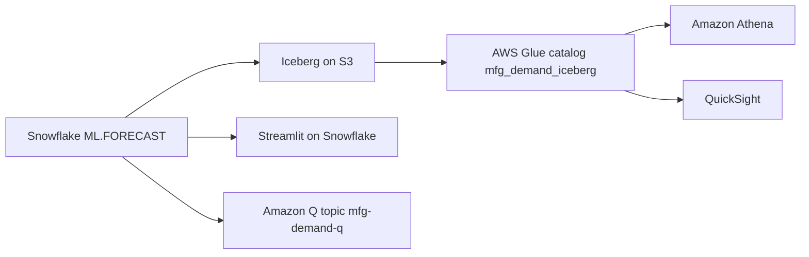

# Demand Optimization & Planning

Intelligent demand forecasting and inventory optimization powered by Snowflake Cortex AI — detect forecast degradation before it becomes overstock.

## AWS Hero — Open Forecast Data Lake

Snowflake + **Apache Iceberg** + **AWS Glue** + **Amazon Athena** + **QuickSight**. Snowflake runs the forecast; the result lands as Iceberg on S3 and registers in the customer's Glue catalog — Athena and QuickSight read it without any copy job.




## Architecture

```
┌─────────┐    ┌───────────────────────────────────────────────────────┐    ┌─────────────┐
│  AWS S3 │───▶│                   SNOWFLAKE                           │───▶│  Streamlit  │
│  (Raw)  │    │  Stages → Dynamic Tables → ML Models → Cortex Agent  │    │  Dashboard  │
└─────────┘    └───────────────────────────────────────────────────────┘    └─────────────┘
                         │                        │
                         ▼                        ▼
                  ┌─────────────┐         ┌─────────────┐
                  │  Semantic   │         │   Cortex    │
                  │    View     │         │   Search    │
                  └─────────────┘         └─────────────┘
```

## Personas

| Persona | Role | Key Questions |
|---------|------|---------------|
| **Maria Santos** | Planning Manager | Which categories are drifting? Where's my overstock risk? |
| **David Kim** | Chief Supply Chain Officer | Are we meeting service levels? What's our capital exposure? |

## Data

| Table | Rows | Description |
|-------|------|-------------|
| PRODUCTS | 500 | Product catalog across 5 categories |
| WAREHOUSES | 10 | Global distribution centers |
| DEMAND_HISTORY | 100,000 | 90 days of daily demand signals |
| INVENTORY | 50,000 | 30-day inventory snapshots |
| PURCHASE_ORDERS | 10,000 | Order pipeline including rush orders |
| PLANNING_DOCS | 80 | Planning procedures and policies |

## Build Instructions

### Prerequisites
- Snowflake account with ACCOUNTADMIN access
- Cortex AI enabled (ML Functions, Search, Agent)
- Warehouse: CORTEX (Medium)

### Deployment

```bash
snowsql -f snowflake/00_setup.sql
snowsql -f snowflake/01_raw_tables.sql
snowsql -f snowflake/02_staging.sql
snowsql -f snowflake/03_dynamic_tables.sql
snowsql -f snowflake/04_search.sql
snowsql -f snowflake/05_ml_models.sql
snowsql -f snowflake/06_semantic_view.sql
snowsql -f snowflake/07_agent.sql
```

### Streamlit App
```
MANUFACTURING_DEMAND.APP.DEMAND_OPTIMIZATION_APP
```

## Key Demo Numbers

- **58%** Electronics forecast accuracy (target 85%)
- **45 days** of supply for Electronics (target 21)
- **$51.6M** overstock value at risk
- **200+** rush orders triggered by forecast miss
- **5 categories** tracked: Electronics, Automotive, Pharma, FMCG, Industrial

## License

Apache 2.0 — See [LICENSE](LICENSE) for details.
