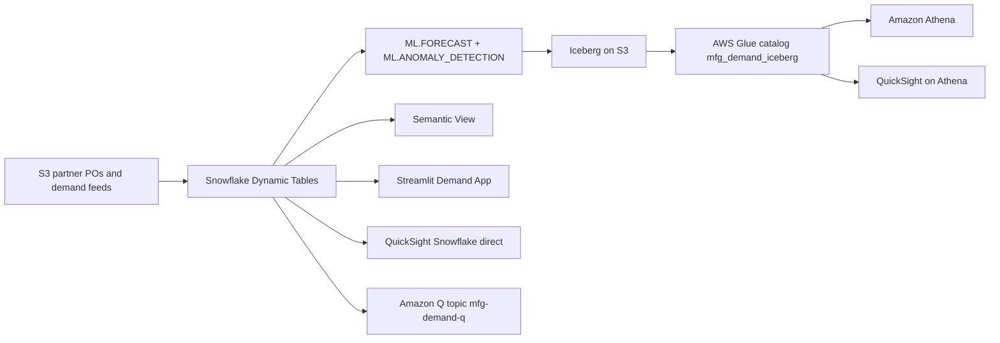

# Demand Optimization & Planning

Intelligent demand forecasting and inventory optimization powered by Snowflake Cortex AI — detect forecast degradation before it becomes overstock.

## Architecture

An open forecast data lake built on **Snowflake** (Dynamic Tables, ML.FORECAST, ML.ANOMALY_DETECTION, semantic view, Cortex Analyst) and **AWS** (S3, Apache Iceberg, AWS Glue, Athena, QuickSight + Amazon Q). Snowflake runs the forecast; the result lands as Iceberg on S3 and registers in the customer's Glue catalog — Athena and QuickSight read it without any copy job.




## Personas

| Persona | Role | Key Questions |
|---------|------|---------------|
| **Maria Santos** | Planning Manager | Which categories are drifting? Where's my overstock risk? |
| **David Kim** | Chief Supply Chain Officer | Are we meeting service levels? What's our capital exposure? |

## Data

| Table | Rows | Description |
|-------|------|-------------|
| PRODUCTS | 500 | Product catalog across 5 categories |
| WAREHOUSES | 10 | Global distribution centers |
| DEMAND_HISTORY | 100,000 | 90 days of daily demand signals |
| INVENTORY | 50,000 | 30-day inventory snapshots |
| PURCHASE_ORDERS | 10,000 | Order pipeline including rush orders |
| PLANNING_DOCS | 80 | Planning procedures and policies |

## Build Instructions

### Prerequisites
- Snowflake account with ACCOUNTADMIN access
- Cortex AI enabled (ML Functions, Search, Agent)
- Warehouse: CORTEX (Medium)

### Deployment

```bash
snowsql -f snowflake/00_setup.sql
snowsql -f snowflake/01_raw_tables.sql
snowsql -f snowflake/02_staging.sql
snowsql -f snowflake/03_dynamic_tables.sql
snowsql -f snowflake/04_search.sql
snowsql -f snowflake/05_ml_models.sql
snowsql -f snowflake/06_semantic_view.sql
snowsql -f snowflake/07_agent.sql
```

### Streamlit App
```
MANUFACTURING_DEMAND.APP.DEMAND_OPTIMIZATION_APP
```

## Key Demo Numbers

- **58%** Electronics forecast accuracy (target 85%)
- **45 days** of supply for Electronics (target 21)
- **$51.6M** overstock value at risk
- **200+** rush orders triggered by forecast miss
- **5 categories** tracked: Electronics, Automotive, Pharma, FMCG, Industrial

## License

Apache 2.0 — See [LICENSE](LICENSE) for details.
This is a personal project and is not an official Snowflake offering. It comes with no support or warranty. Use it at your own risk. Snowflake has no obligation to maintain, update, or support this code. Do not use this code in production without thorough review and testing.
